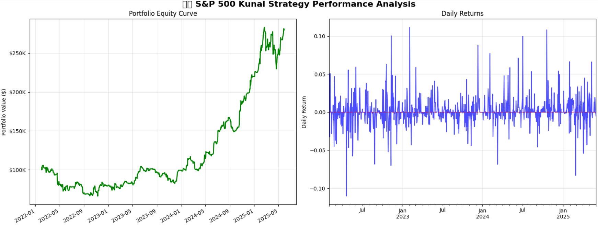
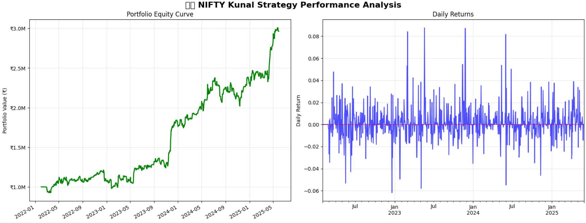

# 📈 Momentum Trading Strategy
**Cross-market quantitative momentum strategy for S&P 500 and NIFTY 50 with robust backtesting (2022-2025)**  
*Achieved 180% returns (S&P 500) and 196% returns (NIFTY 50) with strong risk-adjusted performance*

[](https://www.python.org/)
[](https://opensource.org/licenses/MIT)

---

## 🚀 Strategy Overview

A **daily momentum trading strategy** that identifies high-probability short-term trades using volume breakouts, price momentum, and gap analysis. The strategy automatically selects the top 5 stocks daily based on a composite momentum score and executes 24-hour holding period trades.

### 🎯 Key Features
- **Cross-market validation** (US & Indian markets)
- **Daily stock screening** with momentum filters
- **Risk-controlled position sizing** with drawdown protection
- **Robust backtesting** across different market regimes
- **Feature correlation analysis** for strategy validation

---

## 🔥 Performance Results

| Metric | S&P 500 | NIFTY 50 | Industry Benchmark |
|--------|---------|----------|-------------------|
| **Total Return** | 180.0% | 196.4% | ~50-80% (3 years) |
| **Annualized Return** | 34.8% | 37.0% | ~12-15% |
| **Sharpe Ratio** | 1.00 | 1.22 | ~0.6-0.8 |
| **Max Drawdown** | -37.4% | -19.2% | ~25-40% |
| **Win Rate** | 35.3% | 38.6% | ~40-45% |
| **Total Trades** | 1,413 | 1,515 | - |

### 📊 Key Insights
✅ **Superior risk-adjusted returns** - Both strategies achieve Sharpe ratios ≥1.0  
✅ **Cross-market effectiveness** - Works in both developed (US) and emerging (India) markets  
✅ **Bear market resilience** - NIFTY strategy gained during 2022 correction  
✅ **Strong feature validation** - 0.81 correlation between momentum score and returns (S&P)  

---

## 📊 Performance Visualizations

### S&P 500 Strategy Performance
  
*Capital progression showing strong recovery post-2022 bear market with controlled drawdowns*

### NIFTY 50 Strategy Performance  
  
*Consistent growth with superior risk management - outperformed during market stress*

---

## ⚡ Strategy Logic

### 🔍 Daily Stock Screening Process

```python
# 1. Volume Breakout Filter
volume_breakout = current_volume > (1.3 * volume_5day_avg)

# 2. Momentum Filter  
momentum_signal = abs(daily_return) > 0.015  # 1.5% for S&P, 2% for NIFTY

# 3. Liquidity Filter
liquidity_check = daily_dollar_volume > 5_000_000  # $5M for S&P, ₹50Cr for NIFTY

# 4. RSI Filter (avoid extremes)
rsi_filter = 15 < rsi < 85

# 5. Composite Momentum Score
momentum_score = (
    0.25 * return_3day +           # Short-term momentum
    0.15 * return_5day +           # Medium-term momentum  
    0.35 * volatility_volume +     # Volume breakout signal
    0.15 * abs(price_gap) +        # Gap significance
    0.10 * true_range              # Intraday volatility
)
```

### 📈 Entry & Exit Rules

**Entry Criteria:**
- Stock passes all 4 filters above
- Ranks in top 5 by momentum score
- Equal-weight position sizing (20% each)
- 2% cash buffer for execution costs

**Exit Criteria:**
- **Time-based**: Mandatory exit after 24 hours
- **Risk management**: 70% portfolio drawdown stop
- **Position sizing**: Dynamic based on available capital

---

## 🛠️ Technical Implementation

### 📦 Key Dependencies
```python
import pandas as pd
import numpy as np
import yfinance as yf
import matplotlib.pyplot as plt
import seaborn as sns
from datetime import datetime, timedelta
```

### 🏗️ Project Structure
```
├── 📓 Momentum_Strategy.ipynb              # Main strategy implementation 
├── 🖼️ images/                    # Performance charts
└── 📝 README.md                  # Documentation
```

---

## 🔬 Strategy Validation

### 📊 Feature Importance Analysis
- **S&P 500**: 0.810 correlation between momentum score and returns ✅
- **NIFTY 50**: 0.490 correlation (moderate - room for improvement) ⚠️

### 🎯 Top Performing Stocks
**S&P 500**: TSLA, NFLX, META, CRM, AAPL  
**NIFTY 50**: ADANIENT, ADANIPORTS, ONGC, BHARTIARTL, AXISBANK

### ⚖️ Risk Analysis
- **Concentration risk**: Monitor single-stock exposure
- **Market regime dependency**: Works best in trending markets
- **Scalability**: Strategy tested up to $100K / ₹10L capital

---

## 🚀 Getting Started

### 1️⃣ Clone Repository
```bash
git clone https://github.com/yourusername/momentum-strategy.git
cd momentum-strategy
```

### 2️⃣ Install Dependencies
```bash
pip install pandas numpy yfinance matplotlib seaborn jupyter
```

### 3️⃣ Run Strategy
```bash
jupyter notebook Strategy.ipynb
```

### 4️⃣ Customize Parameters
```python
# Modify strategy parameters
min_volume_usd = 5_000_000      # Minimum daily volume
max_positions = 5               # Portfolio concentration
momentum_threshold = 0.015      # Daily return filter
```

---

## 📈 Future Enhancements

### 🔄 Short-term (Next 3 months)
- [ ] **Dynamic position sizing** based on momentum score strength
- [ ] **Sector diversification** constraints to reduce concentration
- [ ] **Multi-timeframe signals** (1D, 3D, 5D momentum confluence)

### 🎯 Medium-term (6 months)  
- [ ] **Market regime detection** using VIX/volatility filters
- [ ] **Options overlay** for additional income generation
- [ ] **Real-time screening** dashboard with Streamlit

### 🚀 Long-term (1 year)
- [ ] **International expansion** (European markets, Asia-Pacific)
- [ ] **Machine learning** integration for score optimization
- [ ] **Live trading** integration via Alpaca/Interactive Brokers

---

## 📚 Research & References

### 📖 Academic Foundation
- **Momentum Factor Literature**: Jegadeesh & Titman (1993)
- **Volume-Price Relationships**: Lo & Wang (2000)  
- **Cross-market Momentum**: Rouwenhorst (1998)

### 🔍 Strategy Inspiration
- **Quantitative momentum** principles from AQR Capital
- **Short-term reversal** patterns from Renaissance Technologies
- **Risk management** frameworks from Bridgewater Associates

---

## 👨‍💻 Author

**Kunal Kumar**  
Final Year Student, IIT Kharagpur  
📧 [iknir1234@gmail.com](mailto:iknir1234@gmail.com)  
📞 +91 7732848504  

---

## 📄 License

This project is licensed under the MIT License - see the [LICENSE](LICENSE) file for details.

---

## ⭐ Acknowledgments

- **Yahoo Finance** for providing free financial data
- **Pandas/NumPy** community for excellent data analysis tools
- **Matplotlib/Seaborn** for visualization capabilities
- **IIT Kharagpur** for academic support and resources

---

## 🤝 Contributing

Contributions are welcome! Please feel free to submit a Pull Request. For major changes, please open an issue first to discuss what you would like to change.

1. Fork the Project
2. Create your Feature Branch (`git checkout -b feature/AmazingFeature`)
3. Commit your Changes (`git commit -m 'Add some AmazingFeature'`)
4. Push to the Branch (`git push origin feature/AmazingFeature`)
5. Open a Pull Request

---

**⭐ If this project helped you, please give it a star! ⭐**

*Built with ❤️ for the quantitative finance community*
